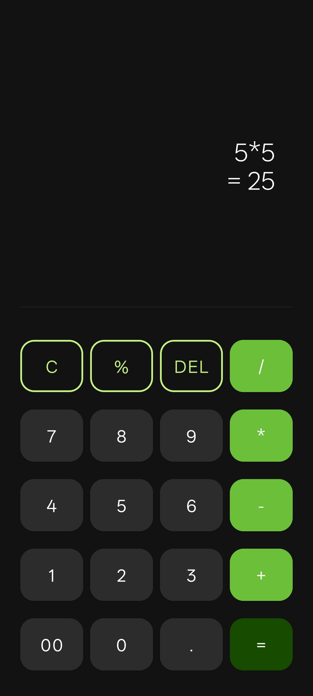

# PRODIGY_AD_01 - UzCalc

This is my Task 01 project for the **PRODIGY InfoTech Android Development Internship**.

## 📱 Project: UzCalc
A modern calculator app built in Android Studio using Java, with a clean Material Design UI.

### ✨ Features
- Perform basic arithmetic operations (addition, subtraction, multiplication, division)
- Supports clear and delete operations
- Dark theme styled UI
- Responsive button layout with Material Design components

### 🛠️ Tech Stack
- Android Studio
- Java
- XML (for UI)
- Material Design components

### 📷 Screenshots

---

### 🚀 How to Run
1. Clone the repository  
2. Open in Android Studio  
3. Build and run on an emulator or Android device  

---

### 📝 Author
**Syed Uzair**  
Internship Task - Prodigy InfoTech  
